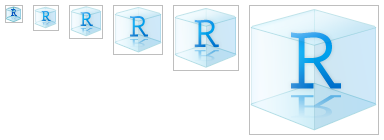
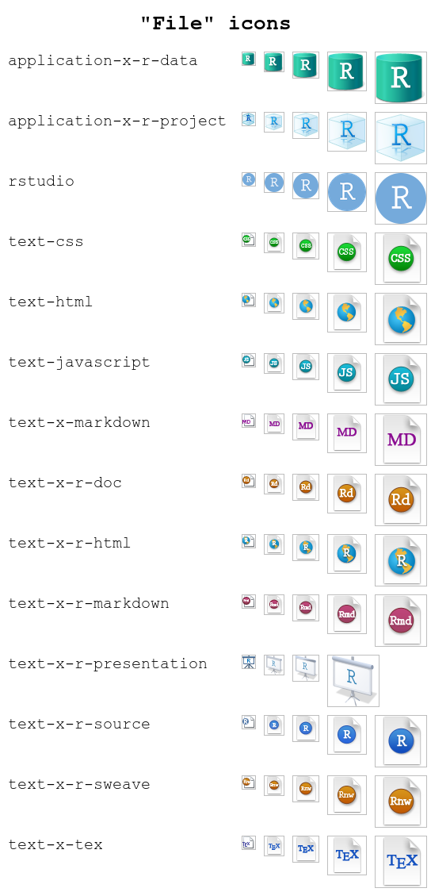

<!-- README.md is generated from README.Rmd. Please edit that file -->

# rsicons

<!-- badges: start -->

[](https://lifecycle.r-lib.org/articles/stages.html#experimental)
<!-- badges: end -->

The goal of `rsicons` is to make the various icons used within the
RStudio IDE available as images that can be embedded in other projects
(e.g. RMarkdown documents, Shiny apps, etc.)

## Installation

<!--
You can install the released version of rsicons from [CRAN](https://CRAN.R-project.org) with:

``` r
install.packages("rsicons")
```
-->

The development version can be installed from
[GitHub](https://github.com/) with:

``` r
# install.packages("devtools")
devtools::install_github("rundel/rsicons")
```

## Example

The core function of the package is `icon()` which lets you insert a
named icon in a chunk

``` r
library(rsicons)
icon("rstudio", height=64)
```


, via inline code
, or any where
else you can embed an image.

Details about each icon can be obtained via the `icon_info()` function,

``` r
icon_info("rstudio")
#> $type
#> [1] "File"
#> 
#> $sizes
#> [1] "16x16"   "24x24"   "32x32"   "48x48"   "64x64"   "128x128" "256x256"
#> [8] "512x512"
#> 
#> $formats
#> [1] "PNG"
```

### Available Icons

A listing of currently available icons can be obtained with
`available_icons()`, this listing can be refined by providing a
`pattern` which uses regular expressions to match the icon names,

``` r
available_icons(pattern = "vcs")
#> $Other
#> [1] "vcsUnstage" "vcsUnstage"
#> 
#> $Source
#> [1] "vcsFileDiff" "vcsFileDiff"
#> 
#> $VCS
#>  [1] "vcsAddFiles"     "vcsAddFiles"     "vcsCommit"       "vcsCommit"      
#>  [5] "vcsDiff"         "vcsDiff"         "vcsIgnore"       "vcsIgnore"      
#>  [9] "vcsPull"         "vcsPull"         "vcsPullRebase"   "vcsPullRebase"  
#> [13] "vcsPush"         "vcsPush"         "vcsRefresh"      "vcsRefresh"     
#> [17] "vcsRemoveFiles"  "vcsRemoveFiles"  "vcsResolve"      "vcsResolve"     
#> [21] "vcsRevert"       "vcsRevert"       "vcsShowHistory"  "vcsShowHistory" 
#> [25] "vcsViewOnGitHub" "vcsViewOnGitHub"
```

Similarly, a list of all available types can obtained with,

``` r
available_types()
#>  [1] "Application"            "Build"                  "Connections"           
#>  [4] "Console"                "Debugging"              "Environment"           
#>  [7] "File"                   "Files"                  "Help"                  
#> [10] "History"                "HTML preview"           "Jobs"                  
#> [13] "Other"                  "Packages"               "packrat"               
#> [16] "PDF"                    "Plots"                  "Plumber IDE features"  
#> [19] "Presentation"           "Profiler"               "Projects"              
#> [22] "RSConnect connectivity" "Shiny IDE features"     "Source"                
#> [25] "Terminal"               "Tutorial"               "VCS"                   
#> [28] "Version control"        "Viewer"                 "Workspace"
```

If instead you would would more directly like to view the available
icons, you can use the preview functions:

``` r
preview_icon("application-x-r-project")
```



``` r
preview_type("File")
```



### All Current Icons


