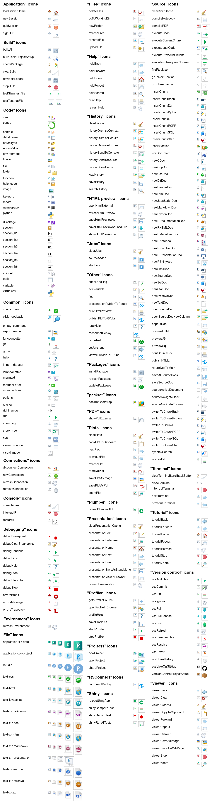

<!-- README.md is generated from README.Rmd. Please edit that file -->

# rsicons

<!-- badges: start -->

[](https://lifecycle.r-lib.org/articles/stages.html#experimental)
[](https://github.com/rundel/rsicons/actions)
<!-- badges: end -->

The goal of `rsicons` is to make the various icons used within the
RStudio IDE available as images that can be embedded in other projects
(e.g. RMarkdown documents, Shiny apps, etc.)

## Installation

<!--
You can install the released version of rsicons from [CRAN](https://CRAN.R-project.org) with:

``` r
install.packages("rsicons")
```
-->

The development version can be installed from
[GitHub](https://github.com/) with:

``` r
# install.packages("devtools")
devtools::install_github("rundel/rsicons")
```

## Example

The core function of the package is `icon()` which lets you insert a
named icon in a chunk.

``` r
library(rsicons)
icon("rstudio", height = 24)
```


``` r
icon("rstudio", height = 64)
```


You can also use `icon()` via inline code
, or anywhere
else you can embed an image.

Details about each icon can be obtained via the `icon_info()` function,

``` r
icon_info("rstudio")
#> $type
#> [1] "File"
#> 
#> $sizes
#> [1] "16x16"   "24x24"   "32x32"   "48x48"   "64x64"   "128x128" "256x256"
#> [8] "512x512"
#> 
#> $formats
#> [1] "PNG"
```

See the [Get Started](articles/get-started.html) vignette for more
information.

<details>
<summary>
See all available icons
</summary>

</details>
